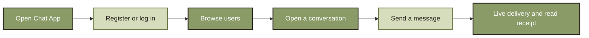
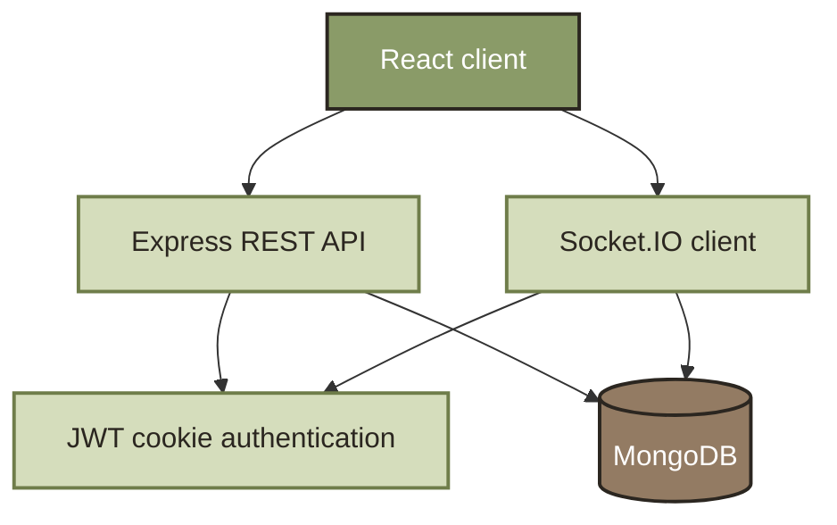
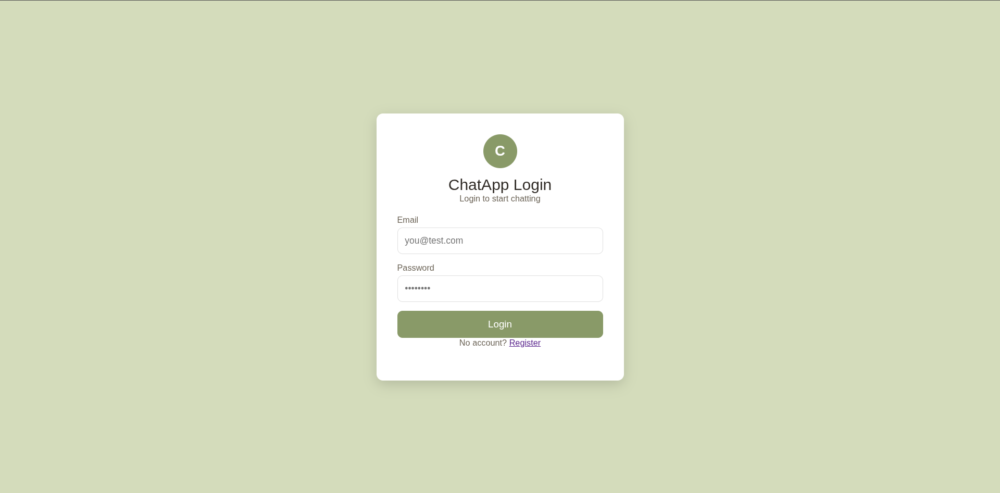
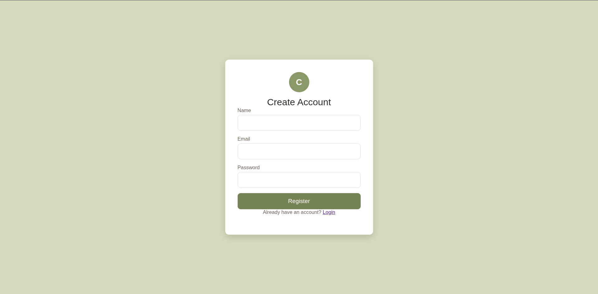
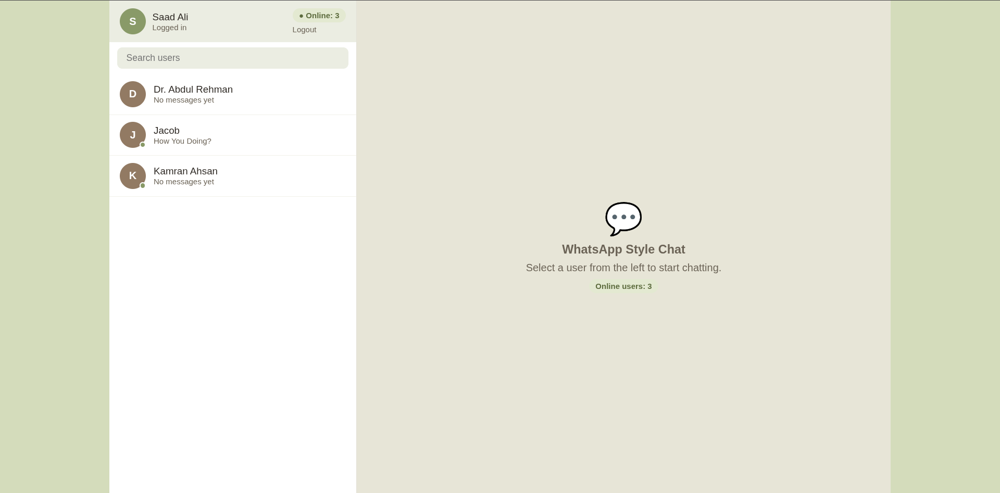
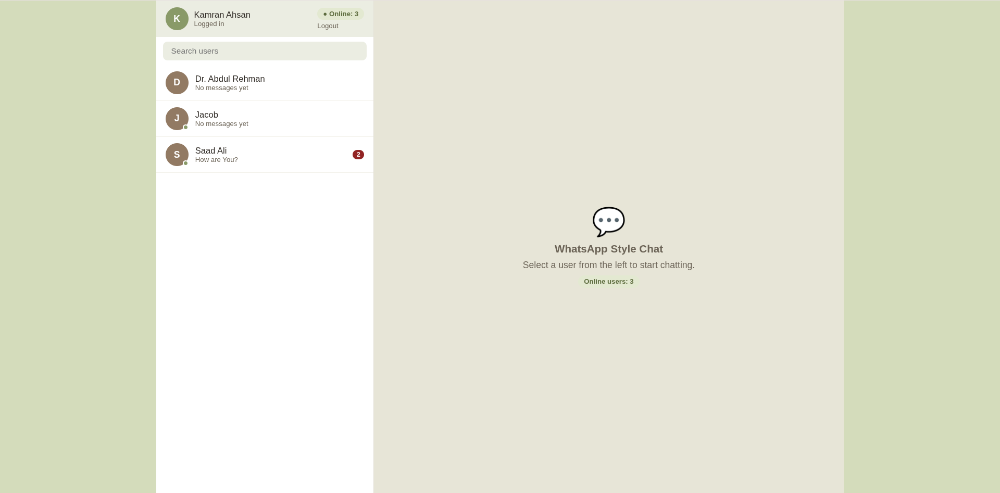
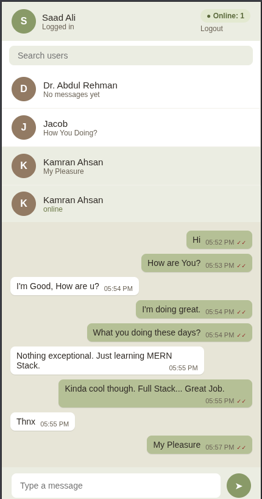

# Chat App


**Stack Used:**

[](https://react.dev/)
[](https://vite.dev/)
[](https://nodejs.org/)
[](https://expressjs.com/)
[](https://www.mongodb.com/)
[](https://socket.io/)

## Real-Time Messaging

> A focused one-to-one chat experience for connecting users through fast, persistent conversations.

This full-stack application combines a React frontend with an Express and Socket.IO backend. Users can create an account, find other registered users, exchange messages in real time, and keep track of presence, unread conversations, and read receipts.

<p align="center">
	<strong>Find a user. Start a conversation. Stay connected.</strong>
</p>

<p align="center">
	<a href="#getting-started">Quick start</a> ·
	<a href="#product-tour">Product tour</a> ·
	<a href="#project-structure">Project structure</a> ·
	<a href="#screenshots">Screenshots</a>
</p>

## The Product In One Minute

| | Capability | What it does |
| --- | --- | --- |
| **01** | Authentication | Register, log in, restore a session, and log out securely |
| **02** | User discovery | Search the list of registered users |
| **03** | Real-time chat | Send and receive direct messages instantly with Socket.IO |
| **04** | Presence | See the number of online users and online indicators |
| **05** | Conversation status | Track unread messages and read receipts |
| **06** | Responsive layout | Use the chat interface across desktop and mobile screen sizes |

### One conversation, three useful signals

| Online status | Unread badge | Read receipt |
| --- | --- | --- |
| Know when users are connected. | Return to conversations that need attention. | See when sent messages have been read. |

## The Chat Workflow



| Stage | Screen area | Responsibility |
| --- | --- | --- |
| **1** | **Authentication** | Create an account or access an existing session |
| **2** | **User list** | Search contacts and view previews, badges, and presence |
| **3** | **Chat thread** | Load history, send messages, and follow delivery status |
| **4** | **Socket connection** | Broadcast messages, online status, unread updates, and read events |

## What Is Included

### Authentication

- Registration and login forms
- JWT session stored in an HTTP-only cookie
- Protected API and Socket.IO connections
- Logout with cookie and socket cleanup

### Messaging

- Persistent one-to-one message history in MongoDB
- Real-time message delivery
- Latest-message previews in the user list
- Unread message counts and read receipts
- Typing event support

### User experience

- Searchable user list
- Online user count and presence dots
- Responsive desktop and mobile layout
- Empty states for unopened and empty conversations

## Architecture At A Glance



The client uses Axios for authenticated REST requests and Socket.IO for live chat events. The server protects routes and socket connections with JWT cookies, while Mongoose stores users and messages in MongoDB.

## Tech Stack

| Layer | Technology |
| --- | --- |
| Frontend | React 19, React Router, Axios |
| Build tool | Vite 8 |
| Backend | Node.js, Express 5 |
| Real-time communication | Socket.IO |
| Database | MongoDB with Mongoose |
| Authentication | JWT, HTTP-only cookies, bcryptjs |
| Code quality | ESLint |

## Project Structure

```text
chat-app-assignment/
├── client/
│   ├── src/
│   │   ├── api/              # Axios API client
│   │   ├── components/       # User list and chat thread
│   │   ├── pages/            # Login, registration, and chat views
│   │   ├── App.jsx           # Routes and authentication state
│   │   └── socket.js         # Socket.IO client
│   └── package.json
├── server/
│   ├── config/               # Database configuration
│   ├── controller/           # Auth and user controllers
│   ├── middleware/           # JWT protection middleware
│   ├── models/               # User and message schemas
│   ├── routes/               # Auth and user routes
│   ├── server.js             # Express server entrypoint
│   ├── socket.js             # Socket.IO event handlers
│   └── package.json
├── ScreenShots/              # Application screenshots and demo video
└── README.md
```

## Getting Started

### Prerequisites

- Node.js 18 or newer
- npm
- A running MongoDB instance or MongoDB Atlas database

### Install dependencies

Install each package from the project root:

```bash
cd server
npm install

cd ../client
npm install
```

### Configure the server

Create `server/.env`:

```env
DB_URI=mongodb://127.0.0.1:27017/chat-app
JWT_SECRET=replace-with-a-long-random-secret
PORT=3000
CLIENT_URL=http://localhost:5173
NODE_ENV=development
```

The client defaults to `http://localhost:3000`. For a different backend URL, create `client/.env`:

```env
VITE_API_URL=http://localhost:3000
```

Do not commit real secrets.

### Start the application

Run the server in one terminal:

```bash
cd server
npm run dev
```

Run the client in another terminal:

```bash
cd client
npm run dev
```

Open [http://localhost:5173](http://localhost:5173), register two accounts, and start a conversation.

## Available Scripts

### Client

- `npm run dev` - starts the Vite development server
- `npm run build` - builds the app for production
- `npm run preview` - previews the production build
- `npm run lint` - runs ESLint checks

### Server

- `npm run dev` - starts the API and Socket.IO server with Nodemon

## API Endpoints

All API routes are served under `/api`.

| Method | Endpoint | Description | Auth |
| --- | --- | --- | --- |
| `POST` | `/api/auth/register` | Create an account and sign in | No |
| `POST` | `/api/auth/login` | Sign in | No |
| `POST` | `/api/auth/logout` | Clear the session cookie | No |
| `GET` | `/api/auth/me` | Get the current user | Yes |
| `GET` | `/api/chat/users` | List users and message previews | Yes |
| `GET` | `/api/chat/users/:id` | Get a user by ID | Yes |

Chat history, message delivery, presence, unread counts, read receipts, and typing notifications use the authenticated Socket.IO connection.

## Product Tour

### 1. Create an account

Register with a name, email, and password. The server creates the user and starts an authenticated session.

### 2. Find a user

Use the user list and search field to locate another registered user. Presence dots show connected users.

### 3. Send a message

Open a user and send a message from the chat composer. Messages are persisted and delivered to both participants in real time.

### 4. Follow conversation status

Unread badges, online counts, and read receipts update as the conversation changes.

## Screenshots

### Login



### Registration



### Chats



### Two Users Chatting


### Unread Chats



### Mobile View



## Video Demo

<video controls width="720">
	<source src="ScreenShots/Responsiveness.mp4" type="video/mp4">
	Your browser does not support the embedded video.
</video>

## Production Notes

- Set `NODE_ENV=production` and use HTTPS so secure cookies work correctly.
- Set `CLIENT_URL` to the deployed frontend origin.
- Set `VITE_API_URL` to the deployed backend origin before building the client.
- Use a strong private `JWT_SECRET` and a production MongoDB connection string.
